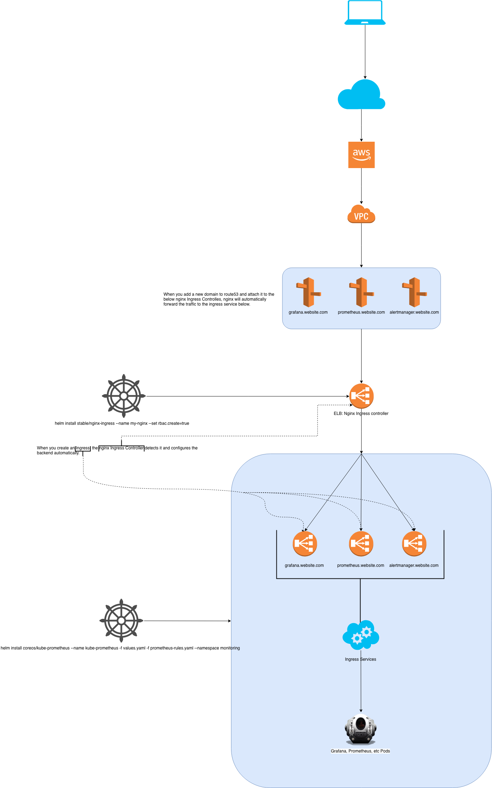
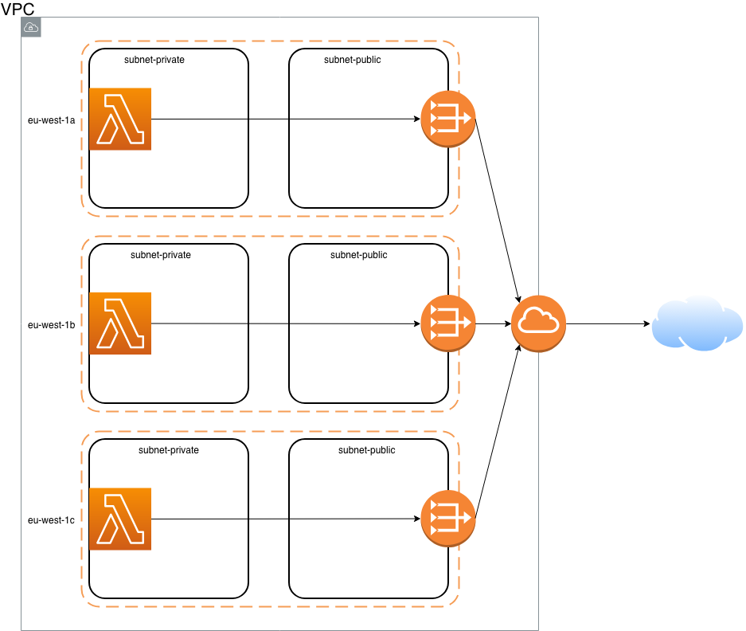

#### Security Overview of AWS Lambda. An In-Depth Look at Lambda Security. March 2019

`https://d1.awsstatic.com/whitepapers/Overview-AWS-Lambda-Security.pdf`

### AWS Profiles

`aws configure --profile <profile-name>` to configure profiles so below files will end up like that

Example:

```
cat ~/.aws/config
[profile1]
region = eu-west-2
output = json
[profile2]
region = eu-west-1
output = json
```

```
cat ~/.aws/credentials
[profile1]
aws_access_key_id = KEY_ID
aws_secret_access_key = ACCESS_KEY
[profile2]
aws_access_key_id = KEY_ID
aws_secret_access_key = ACCESS_KEY
```

Then do `export AWS_PROFILE=profile-name` to use this profile with `awscli` and `kubectl`.

After that `aws sts get-caller-identity` should get you your identity you will be using to connect to AWS.

Now this should work `aws eks list-clusters` this will show eks clusters in the current region. 

For another region do  `aws eks list-clusters --region eu-west-1`

```
{
    "clusters": [
        "eks-test"
    ]
}
```

Kubectl


```
$kubectl config current-context

$kubectl cluster-info
Kubernetes master is running at https://..........eks.amazonaws.com
CoreDNS is running at https://..........eks.amazonaws.com/...
To further debug and diagnose cluster problems, use 'kubectl cluster-info dump'.
```

Every kubectl command you run will apply to above cluster.

If you followed https://docs.aws.amazon.com/eks/latest/userguide/getting-started.html?shortFooter=true and created EKS cluster in Console using one user but you want to use another user to manage it you need to add that user to `aws-auth` config map for that cluster.

Edit config map and add Map user section:

```
  mapUsers: |
  - userarn: Add your new user arn here
      username: Add your new username here
      groups:
        - system:masters
```

Below will open a text file in vi which shouldn't be in use in the 21st century. If after saving the file you get an error, check spaces as they are important.

`kubectl edit -n kube-system configmap/aws-auth`

BEFORE (file truncated)

```
# Please edit the object below. Lines beginning with a '#' will be ignored,
# and an empty file will abort the edit. If an error occurs while saving this file will be
# reopened with the relevant failures.
#
apiVersion: v1
data:
  mapRoles: "This section should already be configured with worker nodes details"
kind: ConfigMap
metadata:
  annotations:
    .
    .
    .
    .
    .
    .
    .
```


AFTER (file truncated)

```
# Please edit the object below. Lines beginning with a '#' will be ignored,
# and an empty file will abort the edit. If an error occurs while saving this file will be
# reopened with the relevant failures.
#
apiVersion: v1
data:
  mapRoles: "This section should already be configured with worker nodes details"
  mapUsers: |
  - userarn: Add your new user arn here
      username: Add your new username here
      groups:
        - system:masters
kind: ConfigMap
metadata:
  annotations:
    .
    .
    .
    .
    .
    .
    .
```


```
***************************************************************************************************
***************************************************************************************************
```

#### Ingress Process - The process of getting traffic from the internet into the pod. Example based on grafana.


 


```
***************************************************************************************************
***************************************************************************************************
```

#### Ingress Process - The process of getting traffic from Lambda into the pod. Example based on grafana.

Create a LoadBalancer service that points to grafana pod. This will create an internal URL for you to point Lambda script to ie. internal-xxxxxxxxxxxxxxxxxxxxx-xxxxxxxxxxx.region.elb.amazonaws.com

```
apiVersion: v1
kind: Service
metadata:
  name: lambda-to-grafana
  annotations:
    service.beta.kubernetes.io/aws-load-balancer-internal: 0.0.0.0/0
spec:
  type: LoadBalancer
  selector:
    app: kube-prometheustest-grafana
  ports:
  - protocol: TCP
    port: 80
    targetPort: 3000
```

Create IAM role for Lambda to be able to connect to VPC.

Create Lambda (node.js 8.10) and attach to a VPC and Subnets where the pod resides and use below script.

```
const http = require('http');
exports.handler = async (event, context) => {
    return new Promise((resolve, reject) => {
        const options = {
            host: 'internal-xxxxxxxxxxxxxxxxxxxxx-xxxxxxxxxxx.region.elb.amazonaws.com',
            path: '/api/dashboards/home/',
            port: 80,
            method: 'GET'
        };
        const req = http.request(options, (res) => {
          let data = '';

          // A chunk of data has been recieved.
          res.on('data', (chunk) => {
            data += chunk;
          });

          // The whole response has been received. Print out the result.
          res.on('end', () => {
            console.log(JSON.parse(data));
            });

        });
        req.write('');
        req.end();
    });
};
```

```
***************************************************************************************************
***************************************************************************************************
```

#### Ingress Process - The process of getting traffic from Lambda to the internet.

For Lambda in VPC to have internet access, it requires:

1 - One "public" subnet in VPC with 0.0.0.0/0 route to the IGW gateway

2 - Above "public" subnet with a NAT GW assigned to it.

3 - One "private" subnet in the same VPC with 0.0.0.0/0 route to above NAT gateway

This is the simplest solution without redundancy as both subnets will be in a single AZ.

A subnet can only span one AZ so to have a high availability solution, you will need multiple subnets spanning multiple zones - each zone's private subnets would point to the NAT Gateway in that zone's public subnet, with separate routing tables for each zone.

For 3 zones in eu-west you will need 6 subnets, 2 in each AZ. One public and one private.





```
***************************************************************************************************
***************************************************************************************************
```

Add custom cloudwatch check to EC2 instance

Add `CloudWatchAgentServerPolicy` policy to a new role and attach to the vm you want to monitor or add `CloudWatchAgentServerPolicy` policy to current role already attached to the vm you want to monitor.

Login to VM

Create a folder
`mkdir amazon-cloudwatch-agent`

`cd amazon-cloudwatch-agent`

Download Agent
`wget https://s3.amazonaws.com/amazoncloudwatch-agent/amazon_linux/amd64/latest/amazon-cloudwatch-agent.rpm`

Install Agent
`sudo rpm -U ./amazon-cloudwatch-agent.rpm`

`cd /opt/aws/amazon-cloudwatch-agent/bin`

Use wizard to configure it `sudo /opt/aws/amazon-cloudwatch-agent/bin/amazon-cloudwatch-agent-config-wizard
` OR copy `config.json` / `config_disk_ram.json` from this repo

`sudo nano config.json`

`sudo nano config_disk_ram.json`


Start Agent
`sudo /opt/aws/amazon-cloudwatch-agent/bin/amazon-cloudwatch-agent-ctl -a fetch-config -m ec2 -c file:config_disk_ram.json -s`

Status Agent
`sudo /opt/aws/amazon-cloudwatch-agent/bin/amazon-cloudwatch-agent-ctl -m ec2 -a status`

Stop Agent
`sudo /opt/aws/amazon-cloudwatch-agent/bin/amazon-cloudwatch-agent-ctl -m ec2 -a stop`

After a few minutes you should be able to see it coming in CloudWatch Metrics.


```
***************************************************************************************************
***************************************************************************************************
```

#### Other useful Lambda scripts:

##### Lambda to check if the website is up

```
'use strict';

var url = require('url');
var target = 'http://grafana.url'; // Change this one

exports.handler = function(event, context, callback) {
  var urlObject = url.parse(target);
  var mod = require(
    urlObject.protocol.substring(0, urlObject.protocol.length - 1)
  );
  console.log('[INFO] - Checking ' + target);
  var req = mod.request(urlObject, function(res) {
    res.setEncoding('utf8');
    res.on('data', function(chunk) {
      console.log('[INFO] - Read body chunk');
    });
    res.on('end', function() {
      console.log('[INFO] - Response end');
      callback();
    });
  });

  req.on('error', function(e) {
    console.log('[ERROR] - ' + e.message);
    callback(e);
  });
  req.end();
};
```

##### Lambda to GET

```
    const http = require('http');
    exports.handler = async (event, context) => {
    return new Promise((resolve, reject) => {
        const options = {
            host: 'grafana.url',
            path: '/api/dashboards/home/',
            port: 80,
            method: 'GET'
        };
        const req = http.request(options, (res) => {
          let data = '';

          // A chunk of data has been recieved.
          res.on('data', (chunk) => {
            data += chunk;
          });

          // The whole response has been received. Print out the result.
          res.on('end', () => {
            console.log(JSON.parse(data));
            });

        });
        req.write('');
        req.end();
    });
};
```

Another Lambda to GET

```
var http = require('http');

exports.handler = function(event, context) {
    http.get('http://grafana.url/api/dashboards/home/', function(res) {
        var body = '';
        res.on('data', function(chunk) {
            body += chunk;
        });

        res.on('end', function() {
            console.info(body);
            context.done(null);
        });
    }).on('error', function(e) {
        console.error(e.message);
        context.fail(null);
    });
};
```


